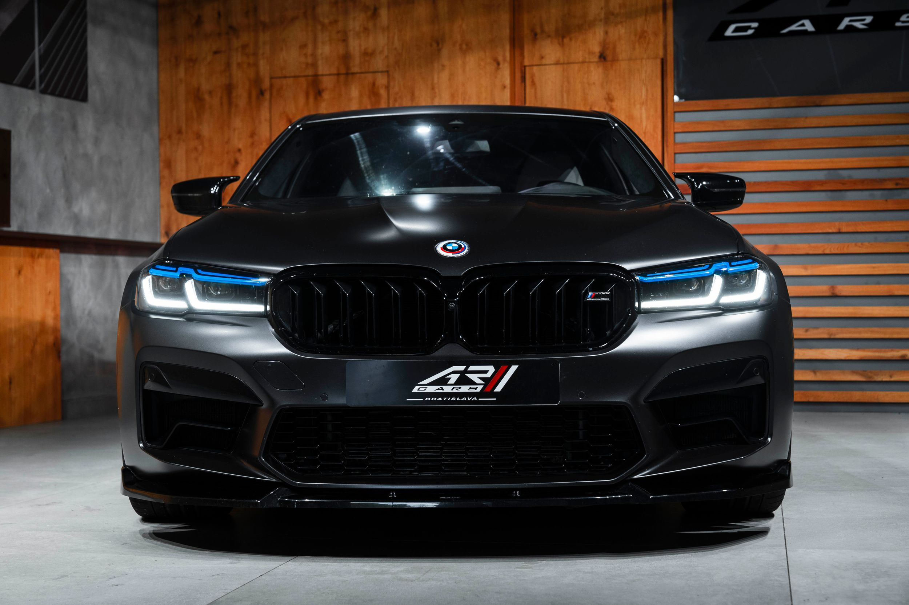

# BMW M5 Competition - Moderní webová prezentace

Kompletní, plně optimalizovaná webová prezentace zaměřená na specifikace, design a zajímavosti o ikonickém supersedanu BMW M5 Competition. Projekt slouží jako ročníková práce pro předmět Webové technologie.

## Úvod

Tento projekt byl vytvořen pomocí čistých webových technologií HTML5, CSS3 a Vanilla JavaScriptu bez použití externích frameworků.
Hlavním cílem bylo vytvořit moderní responzivní web s důrazem na výkon, SEO optimalizaci, přístupnost, kvalitní UI/UX a správnou technickou dokumentaci.

### Odkaz na živý web

https://nikesapro.github.io/rocnikova-prace-levandovsky/

### GitHub repozitář

https://github.com/nikesapro/rocnikova-prace-levandovsky

---

# Prohlášení o vypracování projektu

Tento projekt byl vypracován autorem samostatně na základě reálných automobilových specifikací a grafických podkladů vozu BMW M5 Competition. Během kódování a optimalizace responzivity byla jako pomocný nástroj využita umělá inteligence (AI), která asistovala při odstraňování chyb v kódu, optimalizaci struktury projektu a ladění mobilního zobrazení. Finální podoba webu je výsledkem vlastní práce autora.

---

# 1. Použité technologie

| Technologie               | Využití                        |
| ------------------------- | ------------------------------ |
| HTML5                     | Sémantická struktura stránky   |
| CSS3                      | Stylování a responzivní design |
| Flexbox                   | Rozložení navigace a formuláře |
| CSS Grid                  | Galerie obrázků                |
| Vanilla JavaScript (ES6+) | Interaktivita formuláře        |
| Git & GitHub              | Verzování projektu             |
| GitHub Pages              | Nasazení webu                  |

## Vývojové prostředí

* Windows 11
* Visual Studio Code

## Použitá rozšíření

* Live Server
* Prettier
* ESLint

---

# 2. Adresářová struktura

```text
projekt/
│
├── car1.webp        # Hlavní úvodní fotografie webu
├── car2.webp        # Detail exteriéru BMW M5
├── car3.webp        # Interiér vozidla BMW M5
├── index.html       # Hlavní HTML dokument
├── style.css        # Kompletní CSS stylování
├── script.js        # JavaScript logika formuláře
├── robots.txt       # Pravidla pro vyhledávací roboty
├── sitemap.xml      # XML mapa webu
└── README.md        # Technická dokumentace projektu
```

---

# 3. Technický rozbor optimalizací

## 3.1 Výkon (Performance)

### Teoretický popis

Optimalizace výkonu byla zaměřena na minimalizaci načítání stránky a zrychlení renderování obsahu. Byly použity moderní formáty obrázků `.webp`, lazy loading obrázků a minimalizace počtu externích souborů.

### Ukázka řešení

```html

```

### Vysvětlení

Atribut `loading="lazy"` zajišťuje, že se obrázky načtou až v okamžiku, kdy se uživatel přiblíží k jejich zobrazení.
Použití formátu `.webp` výrazně snižuje velikost obrázků oproti PNG nebo JPG.

---

## 3.2 SEO Optimalizace

### Teoretický popis

Web používá správnou HTML sémantiku, meta tagy, sitemap.xml a robots.txt pro lepší indexaci ve vyhledávačích.

### Ukázka řešení

```html
<meta name="description" content="Kompletní webová prezentace o legendárním vozu BMW M5 Competition.">
<meta name="keywords" content="bmw m5, m5 competition, supersport">
```

### Vysvětlení

Meta description pomáhá vyhledávačům pochopit obsah stránky a zobrazuje se ve výsledcích vyhledávání.
Soubor `sitemap.xml` usnadňuje indexaci webu roboty Google.

---

## 3.3 Přístupnost (Accessibility)

### Teoretický popis

Web byl navržen s důrazem na čitelnost, kontrast barev a správné používání HTML elementů.

### Ukázka řešení

```html
<label for="email">E-mail:</label>
<input type="email" id="email" required>
```

### Vysvětlení

Použití `label` elementů zlepšuje přístupnost pro čtečky obrazovky a usnadňuje ovládání formulářů.

---

## 3.4 Sociální sítě (Open Graph & Twitter Cards)

### Teoretický popis

Byly implementovány Open Graph meta tagy pro správné zobrazování webu při sdílení na sociálních sítích.

### Ukázka řešení

```html
<meta property="og:title" content="BMW M5 Competition">
<meta property="og:description" content="Brutální výkon 625 koní.">
<meta name="twitter:card" content="summary_large_image">
```

### Vysvětlení

Díky Open Graph protokolům se při sdílení odkazu zobrazí náhledový obrázek, titulek a popis stránky.

---

## 3.5 UI/UX Design

### Teoretický popis

Web byl vytvořen metodou Mobile First a následně optimalizován pro větší obrazovky pomocí Media Queries.

### Ukázka řešení

```css
@media (min-width: 768px) {
    .galerie-grid {
        grid-template-columns: repeat(3, 1fr);
    }
}
```

### Vysvětlení

Použití Media Queries umožňuje automatické přizpůsobení layoutu podle velikosti zařízení.

---

## 3.6 AI Integrace

### Teoretický popis

Umělá inteligence byla využita jako pomocný nástroj při návrhu struktury projektu, optimalizaci kódu a generování technické dokumentace.

### Ukázka využití AI

```text
Prompt:
"Optimalizuj responzivní CSS layout pro moderní automobilový web bez použití frameworků."
```

### Vysvětlení

AI pomohla s laděním responzivity, optimalizací struktury CSS a návrhem moderního layoutu.

---

# 4. AI Deník

| Prompt                                                  | Využití                |
| ------------------------------------------------------- | ---------------------- |
| „Vytvoř moderní dark mode design pro automobilový web.“ | Návrh vizuálního stylu |
| „Optimalizuj CSS Grid galerii pro mobilní zařízení.“    | Responzivita galerie   |
| „Navrhni SEO meta tagy pro automobilový web.“           | SEO optimalizace       |
| „Pomoz opravit JavaScript formulář.“                    | Oprava JS logiky       |
| „Jak zlepšit Lighthouse Performance score?“             | Výkon webu             |

---

# 5. Instalace a spuštění projektu

## Lokální spuštění

1. Stáhněte nebo naklonujte repozitář:

```bash
git clone https://github.com/nikesapro/rocnikova-prace-levandovsky.git
```

2. Otevřete projekt ve Visual Studio Code.

3. Nainstalujte rozšíření **Live Server**.

4. Klikněte pravým tlačítkem na `index.html` a zvolte:

```text
Open with Live Server
```

5. Web se automaticky otevře v prohlížeči.

---

# 6. Galerie projektu

## Desktop verze

* Úvodní hero sekce s BMW M5
* Galerie exteriéru a interiéru
* Kontaktní formulář
* Sticky navigace

## Mobilní verze

* Responzivní layout
* Optimalizované fonty a rozestupy
* Přizpůsobená galerie pomocí CSS Grid

---

# 7. Závěr

Projekt splňuje všechny požadavky zadání předmětu Webové technologie.
Byly využity moderní webové technologie bez frameworků s důrazem na výkon, SEO, přístupnost a responzivní design. Web je plně funkční, nasazený pomocí GitHub Pages a optimalizovaný pro desktop i mobilní zařízení.
